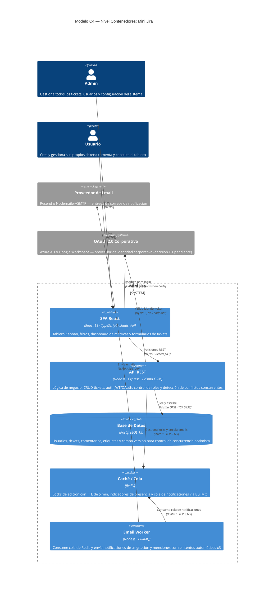

# Modelo C4 — Nivel Contenedores: Mini Jira

**Versión:** 1.0  
**Fecha:** 2026-05-08  
**Autor:** Arquitecto de Software (síntesis de PRD v0.1 + backlog.md v1.0)

---

## Diagrama de Contenedores

---

## Decisiones de Diseño

| Contenedor | Justificación |
|---|---|
| **Redis (doble rol)** | Unifica locks de edición (H3) y cola de emails (PRD §2.6) en un solo contenedor; evita introducir una segunda dependencia de infraestructura en V1 |
| **Email Worker separado** | El PRD exige envío asíncrono para no bloquear la UI; un worker independiente permite reintentos x3 sin acoplar la API |
| **OAuth como `System_Ext`** | Sigue el PRD: "sin SSO por ahora". Se modela como sistema externo opcional — la decisión D1 (Laura) determina si entra en V1 |
| **Campo `version` en PostgreSQL** | Implementa el optimistic locking de H3 sin necesitar un endpoint adicional; el `PATCH /tickets/:id` valida la versión en la misma transacción |

> **Advertencia:** las relaciones `spa → oauth` y `api → oauth` están condicionadas a que Laura apruebe incluir OAuth en V1 (decisión D1 del backlog).
